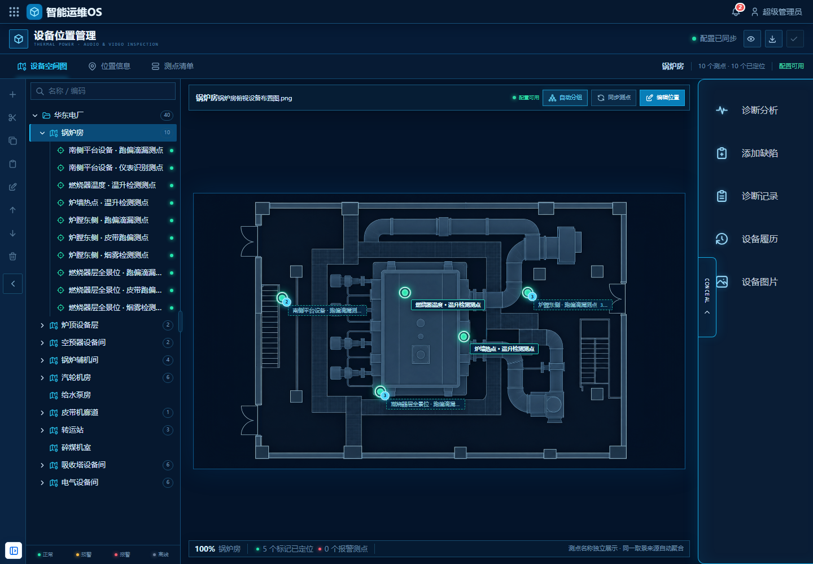
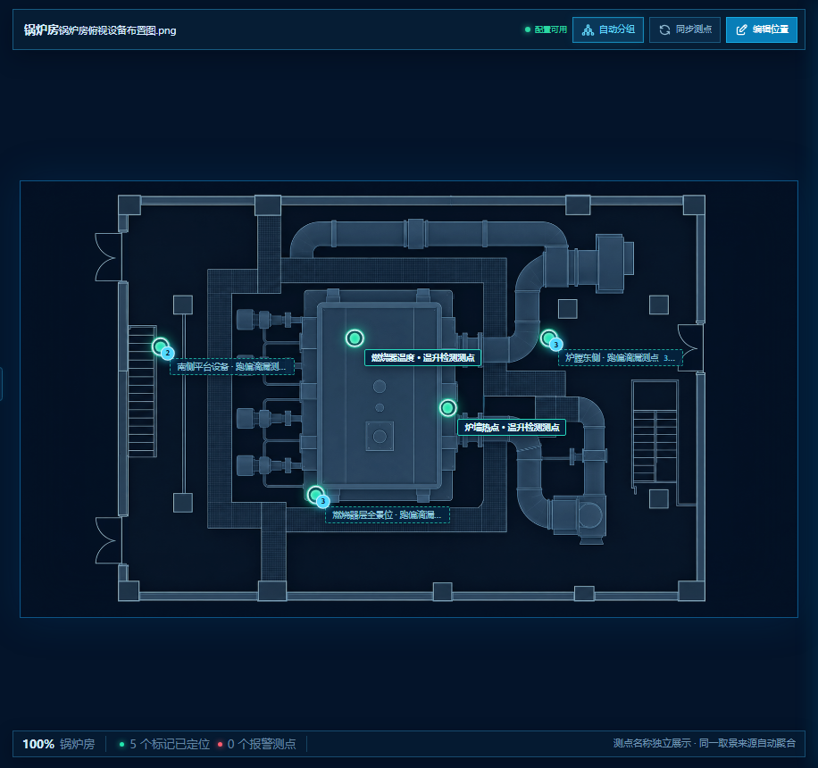
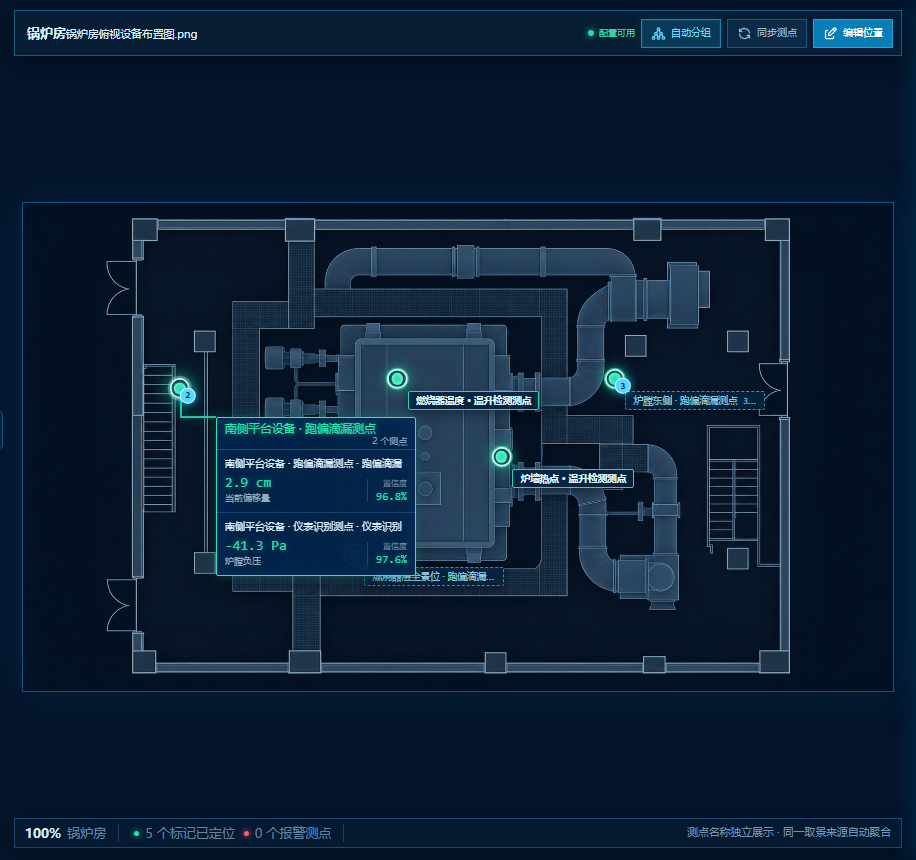
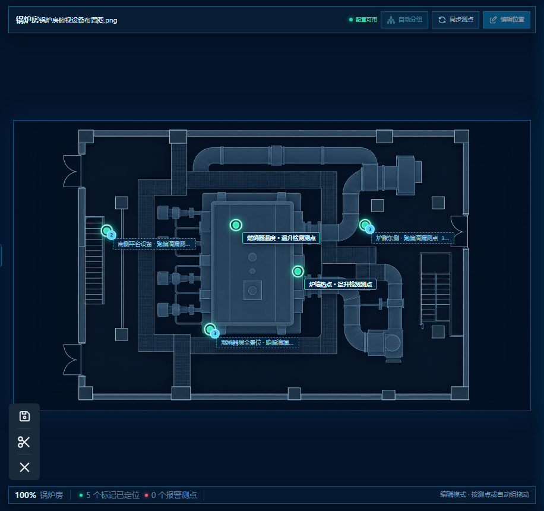
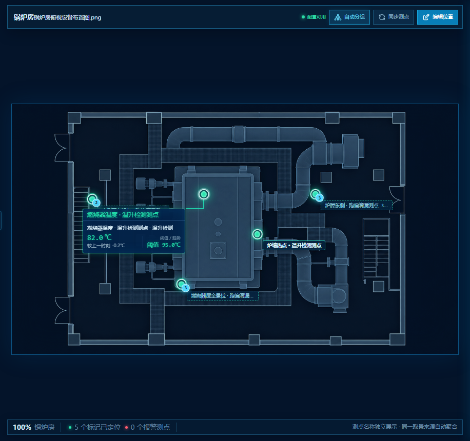

# 具体设计

## 5.1 设备管理—设备位置管理

### 阅读导航

- [5.1.1 功能定位](#511-功能定位)
- [5.1.2 使用对象与权限](#512-使用对象与权限)
- [5.1.3 页面结构](#513-页面结构)
- [5.1.4 数据来源与对象关系](#514-数据来源与对象关系)
- [5.1.5 设备空间树维护](#515-设备空间树维护)
- [5.1.6 平面图配置](#516-平面图配置)
- [5.1.7 测点同步、落位与自动分组](#517-测点同步落位与自动分组)
- [5.1.8 测点位置编辑](#518-测点位置编辑)
- [5.1.9 图面标记](#519-图面标记)
- [5.1.10 本期不做](#5110-本期不做)
- [5.1.11 核心验收用例](#5111-核心验收用例)

---

### 5.1.1 功能定位

本功能是在现有设备管理能力上的增量建设，复用【51018】设备环境树及既有音视频测点目录，为项目交付人员提供火电厂巡检设备空间搭建、平面图配置和测点落位能力。

| 类型 | 具体内容 |
| --- | --- |
| 复用能力 | 【51018】设备环境树结构、节点标识、层级关系、排序及权限；采集站管理中的摄像机、取景来源、测点和算法目录 |
| 本期改造 | 左侧设备树的数据范围和内容；中央平面图的底图上传、测点标记、自动分组及位置编辑 |
| 原样保留 | 除设备树和中央平面图以外的全部原有页面结构、布局、页签、详情、功能入口和交互 |
| 本期不调整 | 设备接入、预置位配置、算法绑定、巡检路线、执行顺序、停留时长和任务调度 |

---

### 5.1.2 使用对象与权限

主要使用对象为项目交付人员。

项目交付人员可执行：

- 搭建和维护巡检设备空间树。
- 上传、替换设备空间平面图。
- 同步已有音视频算法测点。
- 执行自动分组。
- 放置、移动、清除测点位置。
- 检查并保存设备位置配置。

普通运维及管理人员默认仅可查看设备空间图、测点状态、实时结果和巡检区域详情。

删除设备空间时，若空间下存在子空间、平面图或测点位置关系，系统应阻止删除并说明依赖项。

---

### 5.1.3 页面结构

> [!IMPORTANT]
> 设备位置管理沿用原页面结构。本期只改造左侧设备树和中央平面图，其他区域均不做更改。

| 页面区域 | 本期处理方式 |
| --- | --- |
| 左侧设备树 | 调整为仅展示火电厂业务范围内的音视频巡检设备、测点及必要祖先节点 |
| 中央平面图 | 增加独立底图上传、音视频测点标记、自动分组和位置编辑 |
| 页面顶部 | 完全沿用原页面，不新增、不删除、不调整 |
| 原有页签及导航 | 完全沿用原页面，名称、数量、顺序和切换方式均不调整 |
| 原有测点详情 | 完全沿用原页面，布局、字段、按钮和打开方式均不调整 |
| 原有右侧功能区 | 完全沿用原页面，入口、顺序、布局和折叠方式均不调整 |
| 其他弹窗、提示及操作区 | 完全沿用原页面，不因本次功能新增而调整页面结构 |

本期新增或调整的操作入口必须放置在设备树或中央平面图原有区域内，不得为此新增页面层级、顶部区域、独立侧栏或额外任务页签。

选择其他设备空间时，仅联动切换中央平面图及其测点数据；其他原有页面区域继续按照原有逻辑响应当前上下文。



*图 5.1-1　设备位置管理页面结构与本期改造范围*

---

### 5.1.4 数据来源与对象关系

```text
【51018】设备环境树
        ↓ 提供设备空间及层级
设备位置管理
        ↑ 同步
采集站管理：采集站 → 摄像机 → 取景来源 → 算法指标
        ↓
音视频算法测点 → 平面坐标 → 巡检区域详情展示
```

#### 核心数据规则如下：

1. 所有进入设备位置管理的巡检测点，类型固定为“音视频测点”，用户不可修改。
2. 摄像机、预置位、协议、状态和算法均来源于采集站管理，在位置管理中只读。
3. 一个测点必须且只能对应一个算法。
4. 同一取景来源可以包含多个测点，每个测点只对应一个算法。
5. 测点唯一性使用测点标识判断，不使用展示名称去重。
6. 系统内部可保存英文源 ID，但图面、详情和清单以中文测点名称为主。
7. 测点坐标采用相对平面图宽高的百分比坐标，避免画布缩放或分辨率变化造成位置偏移。

| 数据 | 权威来源 | 位置管理是否可编辑 |
| --- | --- | --- |
| 设备空间及层级 | 【51018】设备环境 | 可维护结构，不重新定义标识 |
| 平面图资源 | 设备位置管理 | 可上传、替换 |
| 测点、摄像机、预置位 | 采集站管理 | 否 |
| 测点类型 | 固定为音视频测点 | 否 |
| 唯一算法 | 采集站管理 | 否 |
| X/Y 坐标 | 设备位置管理 | 是 |
| 实时状态及算法结果 | 实时数据服务 | 否 |

---

### 5.1.5 设备空间树维护

设备位置管理复用【51018】设备环境树的层级、节点标识和结构维护能力，但不加载全量设备，形成面向火电厂音视频巡检的业务子树。

#### 设备树保留：

- 火电厂项目、电厂、组织和设备空间等必要祖先节点。
- 锅炉、汽机、输煤、脱硫和电气系统下与音视频巡检有关的设备空间。
- 锅炉房、炉顶设备层、燃烧器层、磨煤机层、空预器设备间、送风机层、汽轮机房、给水泵房、皮带机廊道、转运站、碎煤机室、吸收塔设备间和电气设备间等火电场景节点。
- 上述设备下的音视频测点及算法测点。

#### 设备树排除：

- 纯振动传感器及其测点。
- 接触式温度传感器及其测点。
- 仅采集压力、电流、电压、流量等非音视频信号的设备及测点。
- 与音视频巡检无关的其他监测设备。
- 矿山、选煤厂、仓储、物流、通用生产线及测试/演示场景中的设备和节点。

#### 过滤以设备类型、媒体能力和测点类型为准，不以算法名称判断。例如：

- 红外摄像机的“温升检测测点”属于音视频测点，需要保留。
- 振动传感器的“轴承振动测点”属于非音视频测点，需要排除。

同一火电设备空间同时存在音视频和其他监测设备时，仅展示音视频巡检相关设备和测点。树节点数量、搜索结果、空间统计和待定位数量均按过滤后的火电音视频对象计算。

当前空间没有音视频巡检设备时，展示“暂无音视频巡检设备”，不得使用振动等其他设备填充。

#### 设备空间树支持：

- 名称或编码搜索。
- 新增、剪切、复制、粘贴。
- 重命名、上移和下移。
- 删除空空间。

#### 结构维护规则：

- 根节点不可删除、剪切、复制或重命名。
- 存在子空间、平面图、音视频设备或测点位置关系的空间不可直接删除。
- 新增空间默认没有平面图，不继承其他空间的底图或测点位置。
- 结构修改后进入页面草稿状态，保存配置后形成平台版本。


*图 5.1-2　火电音视频设备空间树及空间结构维护入口*

---

### 5.1.6 平面图配置

每个设备空间独立维护一张 2D 平面图。

#### 具体规则：

- 未配置时，中央画布显示当前空间专属上传入口。
- 支持 PNG、JPG/JPEG、WebP、SVG 格式；大小限制沿用平台文件服务配置，并在上传入口明确展示。
- 上传成功后立即预览，但仅写入页面草稿。
- 支持替换已有平面图。
- 替换平面图时默认保留原有归一化坐标；若图片比例发生明显变化，提示交付人员重新核对测点位置。
- 上传失败时保留原平面图，并说明格式、大小或网络失败原因。
- 平面图应以平台文件资源 ID 持久化，不能依赖浏览器本地 Data URL。
- 切换设备空间后，不得显示或继承其他空间的平面图。



*图 5.1-3　当前设备空间平面图与测点标记*

---

### 5.1.7 测点同步、落位与自动分组

进入页面及点击“刷新同步”时，系统读取采集站管理中已保存的摄像机—取景来源—算法目录。

#### 同步规则：

- 仅同步设备类型或测点类型属于音视频巡检范围的数据。
- 新增测点加入对应设备空间，初始状态为“待定位”。
- 已有测点刷新名称、设备状态、预置位和算法信息，并保留已有空间归属及坐标。
- 同一取景来源可以包含多个测点，每个测点只携带一个算法。
- 重复测点按测点标识去重，不重复生成位置记录。
- 来源删除或失效时，标记为“来源失效”，保存前提示交付人员处理。
- 没有唯一算法的测点进入阻断状态，不可作为完整配置发布。

> [!IMPORTANT]
> 页面固定保留唯一的“自动分组”按钮。

点击后，系统按照以下组合键将同一巡检位下的多个测点自动分为一组：

```text
采集站标识 + 摄像机标识 + 内部巡检位标识
```

#### 自动分组规则：

- 每个算法仍是独立测点，一个测点只对应一个算法。
- 自动分组只改变图面标记的聚合展示和位置联动，不改变测点、算法及采集站来源关系。
- 同一巡检位下的多个测点自动分为一组。
- 不允许跨采集站、跨摄像机或跨巡检位合并。
- 聚合标记展示代表测点名称和组内测点数量。
- 聚合状态取组内最高严重等级：报警、预警、正常、离线。
- 悬停聚合标记时，逐项展示组内各测点的名称、唯一算法和实时结果。
- 拖动、清除或重新定位聚合标记时，组内测点同步更新位置。
- 未分组测点保持一个测点一个标记，并独立定位。
- 刷新采集站测点后重新计算自动分组，同时保留已有位置。

> [!CAUTION]
> 不得提供创建分组、选择成员、改名、拆组或跨巡检位合并等手工分组能力。



*图 5.1-4　同一巡检位多个测点的自动分组结果*

---

### 5.1.8 测点位置编辑

点击“测点位置修改”进入位置编辑态。

#### 编辑态只保留以下操作：

- 保存位置。
- 清除选中位置。
- 取消编辑。

#### 交互规则：

1. 在设备树或测点清单中选择待定位测点。
2. 点击平面图生成对应标记。
3. 已定位标记支持按住拖动，拖动过程中实时跟随。
4. 点击标记后再次点击平面图，可重新指定位置。
5. 清除位置后，测点恢复为“待定位”。
6. 自动组标记移动或清除时，组内测点同步更新坐标。
7. 取消编辑恢复进入编辑态前的全部位置。
8. “保存位置”只写入页面草稿；顶部“保存配置”才生成平台已保存版本。
9. 编辑期间禁止切换空间或进入其他配置页签，必须先保存或取消编辑。



*图 5.1-5　测点位置编辑及三项编辑操作*

---

### 5.1.9 图面标记

默认查看态下，测点标记采用“状态色光点＋引导线＋中文测点名称”展示。

状态至少包括正常、预警、报警、离线和待定位，除颜色外应同时提供文字或可访问说明。

鼠标悬停或键盘聚焦标记时，临时展示实时数据浮层：

- 测点名称及唯一算法。
- 实时主值和单位。
- 算法结果说明。
- 置信度；数值型算法无置信度时展示阈值或趋势。
- 数据更新时间。

自动组浮层逐项展示组内各测点的实时结果，不得将多个算法结果合并为一个结果。

点击标记后的详情打开方式、详情布局、字段、按钮和后续操作完全沿用原页面，不在本次需求中调整。



*图 5.1-6　测点标记悬停时的实时数据浮层*

---

### 5.1.10 本期不做

- 不在位置管理中新增或删除摄像机。
- 不重新选择摄像机或预置位。
- 不新增、修改或多选算法指标。
- 不展示纯振动、接触式温度、压力、电流等非音视频监测设备及测点。
- 不维护 3D 模型、区域框或空间分区。
- 不提供手工测点分组。
- 不配置巡检路线、执行顺序、启停、停留时长和任务调度。
- 不使用跨设备空间的厂区总貌图。

---

### 5.1.11 核心验收用例

| 用例 | 预期结果 |
| --- | --- |
| 原页面结构回归 | 除左侧设备树和中央平面图外，顶部、页签、测点详情、右侧功能区及其他原有页面区域与改造前保持一致 |
| 火电音视频设备树过滤 | 树、搜索结果、节点计数和空间统计仅包含火电厂音视频巡检对象；不出现纯振动等非音视频设备，也不出现矿山、仓储、通用产线或测试场景；红外热成像、音频巡检等设备正常保留 |
| 切换设备空间 | 底图、测点、统计和详情同步切换，无数据串用 |
| 重复刷新同步 | 不生成重复测点，已有坐标保持不变 |
| 同一取景来源多个测点 | 各测点独立存在，且每个测点只对应一个算法 |
| 执行自动分组 | 同一巡检位下的多个测点聚合为一个标记，来源关系保持不变 |
| 自动组位置联动 | 移动、清除或重新定位聚合标记时，组内测点同步更新 |
| 新同步测点 | 初始为待定位，不自动生成坐标 |
| 拖动测点标记 | 标记实时跟随，松开后更新页面草稿 |
| 取消位置编辑 | 恢复进入编辑态前的全部坐标 |
| 删除非空空间 | 阻止删除并展示依赖原因 |
| 采集站管理中的测点状态变化 | 图面和详情状态同步更新，位置不丢失 |
